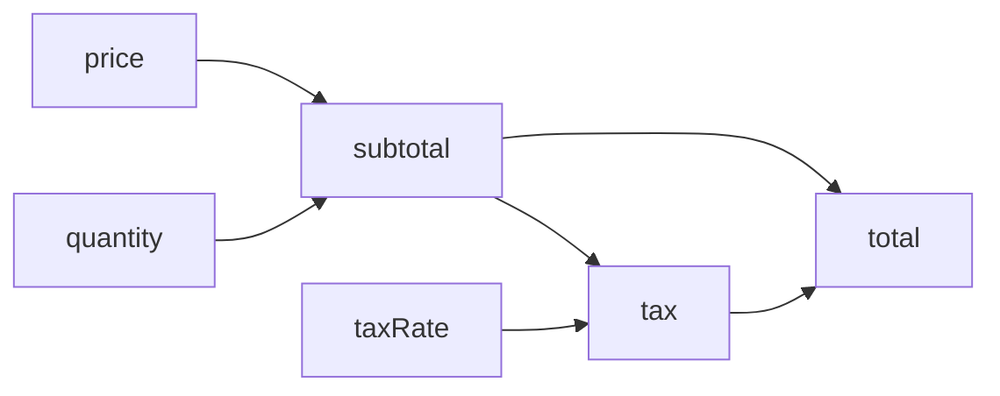

# SoftDep

[](https://github.com/ShilianShen/SoftDep/actions/workflows/ci.yml)
[](https://codecov.io/gh/ShilianShen/SoftDep)

**SoftDep** is a Lua library for describing and executing dependencies between data and tasks.

Instead of manually deciding what needs to be updated after some state changes, you describe the dependency graph and let SoftDep propagate changes and execute only the affected tasks.



For example, changing `taxRate` only requires `tax` and `total` to be recomputed. `subtotal` remains clean.

## Quick Start

SoftDep is currently developed and tested directly from the repository.

```sh
git clone https://github.com/ShilianShen/SoftDep.git
cd SoftDep
lua examples/order_total.lua
```

The example models the total price of an order:

```text
price ───────┐
             ├──> subtotal ──┬──> total
quantity ────┘               │
                             │
taxRate ────────────> tax ───┘
                       ▲
                       │
                    subtotal
```

Initial values are set through node APIs:

```lua
graph.nodes.price.apis.set(20)
graph.nodes.quantity.apis.set(3)
graph.nodes.taxRate.apis.set(0.1)

graph:run()
```

This computes:

```text
compute subtotal: 60
compute tax:      6.0
compute total:    66.0
total:            66.0
```

Now change only the tax rate:

```lua
graph.nodes.taxRate.apis.set(0.2)
graph:run()
```

Only the affected part of the graph is recomputed:

```text
compute tax:      12.0
compute total:    72.0
total:            72.0
```

Notice that `subtotal` is not recomputed.

See the complete example in [`examples/order_total.lua`](examples/order_total.lua).

## How It Works

A SoftDep graph consists primarily of **nodes**, **tasks**, and their dependencies.

### Nodes

A node owns data and contains the tasks and APIs associated with that data.

In the order-total example, `subtotal` is a node whose data contains the calculated subtotal.

### Tasks

A task performs work on a node.

For example:

```lua
subtotal = {
    tasks = {
        compute = {
            parents_d = {
                price = "price",
                quantity = "quantity",
            },
            func = function(data, parents)
                data.value =
                    parents.price.value *
                    parents.quantity.value
            end,
        },
    },
},
```

The `compute` task declares that it depends on the data of the `price` and `quantity` nodes.

SoftDep uses these dependencies to determine execution order and to propagate changes.

### APIs

APIs provide an external interface for changing node state.

The input nodes in the example expose a `set` API:

```lua
set = {
    ttag = "changed",
    func = function(data, value)
        data.value = value
    end,
},
```

Calling:

```lua
graph.nodes.taxRate.apis.set(0.2)
```

changes the data and marks the associated task as dirty.

SoftDep can then propagate that change through the dependency graph.

### Dirty Propagation

A dirty task represents work that may need to be performed.

When a change affects data used by another task, SoftDep propagates the dirty state through the graph.

Conceptually:

```text
taxRate changed
      │
      ▼
     tax
      │
      ▼
    total
```

Unrelated parts of the graph remain clean.

### Data and Control Dependencies

SoftDep distinguishes between two kinds of dependencies.

**Data dependencies** describe which node data a task consumes:

```lua
parents_d = {
    price = "price",
    quantity = "quantity",
}
```

**Control dependencies** describe ordering constraints between tasks:

```lua
parents_c = {
    "prepare",
}
```

Keeping these concepts separate allows execution order and data flow to be modeled independently.

### Access Levels

SoftDep also models how tasks access node data.

Access levels form a configurable partial order. They can be used to distinguish operations such as read-only access from operations that modify observable node state.

For example:

```text
read < write
```

This allows SoftDep to reason about whether executing a task should cause changes to propagate to dependent nodes.

See the design documents for the formal model.

## Execution

The high-level execution method is:

```lua
graph:run()
```

It consists of two phases:

```lua
graph:spread()
graph:update()
```

`spread()` propagates dirty state through the dependency graph.

`update()` executes the dirty tasks in dependency order.

Keeping these operations separate also makes it possible to inspect or visualize the graph between propagation and execution.

## Design

SoftDep is based on a more general model of software dependencies, including data dependencies, control dependencies, access levels, ordering constraints, and dirty-state propagation.

The design is documented here:

- [Introduction](docs/design/00_introduction.md)
- [Definitions](docs/design/01_definitions.md)
- [Problems](docs/design/02_problems.md)
- [Constraints](docs/design/03_constraints.md)
- [Properties](docs/design/04_properties.md)
- [Inducing](docs/design/05_inducing.md)

These documents describe the motivation and formal model behind the implementation.

## Project Status

SoftDep is under active development.

The API and internal model may still change as the design evolves.

Currently, the project is tested with Lua 5.4.

## Third-party Software

SoftDep includes code from `tableshape`, which is licensed under the MIT License.

See [`THIRD_PARTY_LICENSES`](THIRD_PARTY_LICENSES) for details.

## License

SoftDep is released under the [MIT License](LICENSE).
