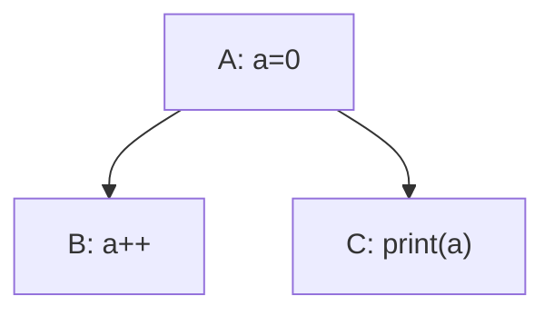
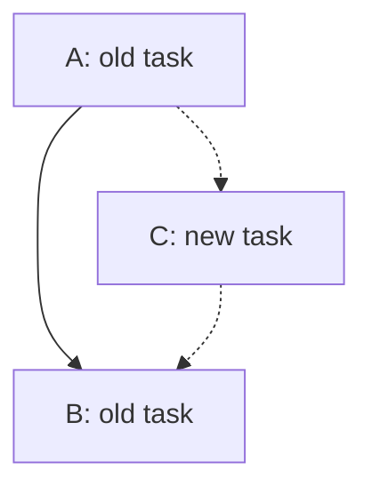

# SoftDep

## Introduction

The name "SoftDep" is derived from "Software" and "Dependency".

Projects can have complex dependencies between tasks or modules.
Such a structure is commonly referred to as a dependency graph.
Following the principle "Don't repeat yourself", we can extract the common dependency management logic into a higher-level abstraction called "SoftDep".

## Definitions

First, there are several basic concepts to define:

- data, just data
- task, something to do, with no responsibility for storing data
- access, a task's permission to access data

There are several kinds of dependencies.

### Control Dependency

$$
deps_c\subseteq \mathcal{T}\times \mathcal{T}
$$

where $(\mathcal{T}, deps_c)$ is a DAG.

For $(a,b)\in deps_c$, we say that $b$ depends on $a$.

### Data Dependency

$$
deps_d\subseteq data\times \mathcal{T}
$$

For $(d, t)\in deps_d$, we say that $t$ depends on $d$.

### Parents and Children

$$
parents_i(x)=\{p|(p, x)\in deps_i\}
$$

$$
children_i(x)=\{c|(x, c)\in deps_i\}
$$

### Path

For $a,b\in \mathcal{T}$, if $a\neq b$ and there is a path in $(\mathcal{T}, deps_c)$ from $a$ to $b$, we write $a\leadsto b$.

### Restriction Notation

For a binary relation $R$ and a set $X$, we denote the restriction of $R$ to $X$ by

$$
R|_X=R\cap(X\times X)
$$

### Order

$<_X\subseteq X\times X, X\subseteq \mathcal{T}$ satisfies the following properties:

- $(X, <_X)$ is a strict total order.
- $\forall (a,b)\in deps_c|_X: a<_X b$

Hereafter, all orders are assumed to be topological orders.

$$
O(X)=\{<_X\subseteq X\times X|(X, <_X)\ \text{is a topological order}\}
$$

### Parallel Tasks

$$
parallel(d) = \{
T\subseteq children_d(d)\mid
\forall a,b\in T: \neg(a\leadsto b\lor b\leadsto a)
\}
$$

Every ordering of the tasks in $T$ can be extended to a topological ordering of the entire task graph.

$$
\forall <_T\in O(T), \exists <\in O(\mathcal{T})\ <_T = <|_T \\
$$

Because there is no path in $T$ we have $|O(T)|=|T|!$.

### Access

$$
access: deps_d\to A
$$

We use $access(d,t)$ as shorthand for $access((d,t))$.

---

$A^\circ$ is the set of available access levels determined by the environment in which SoftDep is used.

$(A^\circ, \le)$ is a partially ordered set satisfying the following properties:

- $\{\bot, \top\}\subseteq A^\circ$
- $\forall a\in A^\circ:\bot\le a\le\top$

For $a, b\in A^\circ$ with $a<b$, we say that $b$ is a higher access level than $a$.

---

$A=DM(A^\circ)$ is the Dedekind–MacNeille completion of $A^\circ$.

Thus, $(A, \le)$ satisfies the following properties:

- $(A, \le)$ is a complete lattice.
- $\forall B\subseteq A$ both $\bigvee_{a\in B}a$ and $\bigwedge_{a\in B}a$ exist.

---

A task can be considered a list of operations or smaller tasks $t = (t_1, \dots, t_n)$. In this case, we can determine the minimum access level required by $t$:

$$
access(d, t)=\bigvee_{i\le |t|}access(d, t_i)
$$

Sometimes, it is useful to consider multiple tasks as a single task. In this way, the minimum access level required by any task group can be determined.

### Dirty

$$
dirty:\mathcal{T}\to\mathbb{B}
$$

$$
dirty_{i+1}(t)=dirty_i(t)\lor(\exists p\in parent_c(t):dirty_i(t))
$$

The sequence $\{dirty_i\}_{i\ge 0}$ takes at least $|\mathcal{T}|$ steps to reach the final value.

## Problems

### Conflict among multiple tasks

In this case the output may be unpredictable, because $(A, B, C)$ and $(A, C, B)$ both satisfy the order condition of Control Dependency.

This problem can occur when a data item has multiple dependent tasks that have no control dependency between them.

But multiple dependent tasks do not always cause this problem.

Assume that $A$ contains the following access levels:

- $OS$: order-sensitive
- $RO$: readonly. Example: `print`
- $OISW$: order-insensitive write without read, meaning that for a data item $d$ and two tasks $a, b$ with $access(d, a), access(d, b)\le OISW$, the results of $(a, b)$ and $(b, a)$ are the same. Example: `x++`

Obviously, these access levels satisfy $OS = RO\vee OISW$.

The problem happens if and only if

$$
\exists d\in data,
\exists T\in parallel(d):
\left(
    \bigvee_{t\in T}access(d, t)\ge OS
\right)
\land (|T|>1)
$$

When the combined access level is order-sensitive, there must be an explicit order to decide which task executes first. But specifying the order explicitly is cumbersome, so we need another approach.

### Poor Extensibility

If a new task is added to the system, it could cause new conflicts or invalidate the existing structure.

## Constraints

### Split the Task

Each task can have an access level greater than or equal to order-sensitive for at most one data item.

$$
\forall t\in \mathcal{T}:\sum_{d\in parents_d(t)}\mathbb{1}[access(d, t)\ge OS]\le 1
$$

If an existing task does not satisfy this property, it can be split into smaller tasks that do.

### Encapsulation

$$
(nodes, deps_n)
$$

Each $n=(d, T, a)\in nodes$ satisfies the following properties:

- $d\in data, T\subseteq \mathcal{T}$
- $\forall t\in \mathcal{T}:((d, t)\in deps_d \land access(d, t)\ge OS)\to t\in T$
- $a\in A, \bigvee_{(d, t)\in deps_d,t\notin T} access(d,t)\le a<OS$

For convenience, we use subscripts to indicate the relationships among $n$, $d$, $T$, and $t$. Variables sharing the same subscript satisfy the relations $n_i=(d_i, T_i)$ and $t_i\in T_i$.

$nodes$ satisfies the following properties:

- $\{d|(d, T, a)\in nodes\}=data$
- $\bigcup_{(d, T, a)\in nodes}T=\mathcal{T}$
- $\forall n_1, n_2 \in nodes, n_1\neq n_2: T_1\cap T_2=\varnothing, d_1\neq d_2$

$deps_n \subseteq nodes\times nodes$ satisfies the following properties:

- $\forall n_1,n_2\in nodes:(n_1,n_2)\in deps_n\leftrightarrow n_1\neq n_2\land \exists (t_1, t_2)\in deps_c$

### DAG Constraint

The strongest constraint of SoftDep is that $(nodes, deps_n)$ must also be a DAG.

Note that this constraint cannot be derived from the previous definitions.

### Local Total Ordering

This constraint requires $deps_c$ to satisfy the following property:

$$
\forall n_i\in nodes:|O(T_i)|=1
$$

In other words, no two tasks in $T_i$ are parallel.

### Node Order

Because $(nodes, deps_n)$ is a DAG, there is also a topological order $<_N$.

The task order $<$ is required to satisfy the following properties:

- $\forall t_1\in T_1, \forall t_2\in T_2:n_1<_Nn_2\to t_1<t_2$

### Backward Node

$$
n_b
$$

This node is introduced to address the problem that nodes cannot affect parent nodes in $(nodes, deps_n)$.

We call it a "node" because it has properties similar to those of normal nodes.

$n_b$ satisfies the following properties:

- $n_b\notin nodes$
- $d_b\notin data$
- $T_b\cap \mathcal{T} = \varnothing$
- The tasks in $n_b$ can read and write any data item.

Some tasks $t_b\notin \mathcal{T}$ cannot belong to any node in $nodes$ because of the DAG constraint, but they can belong to $n_b$.

The tasks in $n_b$ are executed after all other tasks.

## Properties

### No more conflict among multiple tasks

For each data item $d_i$ we can split the $children_d(d_i)$ in two parts $T_i$ and $\overline{T_i}:=children_d(d_i)\setminus T_i$.

Because of node order there is $\forall a\in T_i,\forall b\in\overline{T_i}:a< b$.

Thus $\forall T\in parallel(d):T\subseteq T_i\veebar T\subseteq\overline{T_i}$.

---

Case 1, $T\subseteq T_i$

$$
\begin{aligned}
    \because & \forall T\in parallel(d),\forall <_T\in O(T),\exists <_{T_i}\in O(T_i): <_T=<_{T_i}|_T 
    \\
    & |O(T_i)|=1
    \\
    \therefore & \forall T\in parallel(d),|O(T)|\le|O(T_i)| = 1
    \\
    \because & |O(T)|=|T|!= 1
    \\
    \therefore & |T| = 1
\end{aligned}
$$

---

Case 2, $T\subseteq \overline{T_i}$

$$
\begin{aligned}
    \because & T\subseteq\overline{T_i}
    \\
    \therefore & \bigvee_{t\in T}access(d_i,t)\le\bigvee_{t\in \overline{T_i}}access(d_i,t)\le a_i< OS
\end{aligned}
$$

---

Thus,

$$
\forall d\in data, 
\forall T\in parallel(d):
\left(
    \bigvee_{t\in T}access(d, t)< OS
\right)
\lor (|T|\le1)
$$

Therefore, there is no conflict.

### Better Extensibility

For every $X\subseteq nodes:\delta^-(X)=\varnothing$, $(X, deps_N|_X)$ is also a DAG.

In this case, $(nodes, deps_N)$ can be considered as an extension of $(X, deps_N|_X)$.

Obviously, in this structure, extension can't affect the system before.

Therefore, it's easy to extend an existing system.

## Inducing

$$
\begin{rcases}
    tasks \\
    data \\
    nodes \\
    \dots \\
\end{rcases}
\leftrightarrow
\begin{cases}
    tasks \\
    data \\
    nodes \\
    access \\
    deps_c \\
    deps_d \\ 
    deps_n \\
\end{cases}
$$

