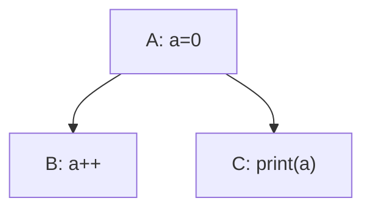
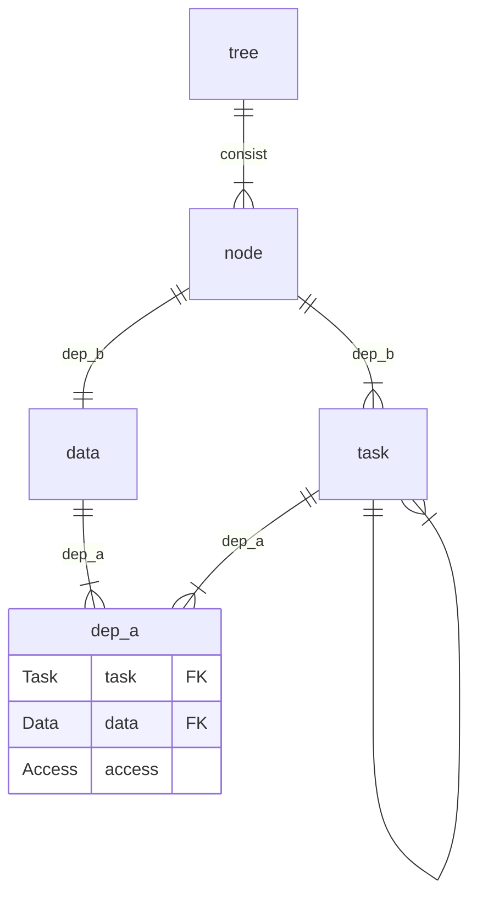

# Design

The name "SoftTree" is derived from "Software" and "Dependency Tree".

## Why does it exist?

Projects can have complex dependencies between tasks or modules.
Such a structure is commonly referred to as a dependency tree.
Following the principle "Don't repeat yourself", we can extract the common dependency management logic into a higher-level abstraction called "SoftTree".

## What are dependencies?

There are several kinds of dependencies.

### Control Dependency

$$
deps_c\subseteq tasks\times tasks
$$

where $(tasks, deps_c)$ is a DAG.

For $(a,b)\in deps_c$, we say that $b$ depends on $a$.

$sort: tasks\to\{1,\dots,|tasks|\}$ is a bijection satisfying $\forall (a,b)\in deps_c:sort(a) < sort(b)$.

$sorts$ is the set of all possible topological orderings.

### Data Dependency

$$
deps_d\subseteq data\times tasks
$$

For $(d, t)\in deps_d$, we say that $t$ depends on $d$ .

### Access Dependency

$$
deps_a: deps_d\to access
$$

$access$ is the set of available accesses, which ist deicded by the uesd environment.

$access$ should at least satisfy $\{\bot, \top\}\subseteq access$, where $\bot$ means lowest permission, $\top$ means highest permission.

> Maybe you guys would ask: "Shouldn't it be 'Dependency Access'?"
> Sure, that the access more like an attribute of the dependency.
> But here access, task and data are on equal footing.
> So, the point of "Access Dependency" is to notice the relation between access and data dependency.

## What are problems?

### Conflict among multiple tasks

In this case the output is unpredictable, cause $(A, B, C)$ and $(A, C, B)$ both satisfy the sort condition of Control Dependency.

This problem would happen, when a part of data has multiple dependening tasks, which have no control dependency between those.

It's ok if the data is readonly for all those tasks. But when there is a wirtable operation, there must be an explicit order to deicde which task first excution.

Obviously the explicit order is kind of sick, so here is anther way wished to be found out..

### 扩展性差

如果希望在这个系统里添加新的task, 就有可能引发新冲突, 而且这一点要依赖于以前的显式排序, 如果显式排序本身就有隐患, 就会变得很难查明.

### 是否允许动态?

在task的调用中, 是否可能创建新的d并添加到data里, 或者task添加到tasks里? 或者删除?

绝对不可以, 这个问题的情景下的拓扑排序什么的, 十分依赖固定的tasks和data, 而且理论上通过结构体或者数组什么的, 可以实现将新数据归纳到已有数据中, 应该不会出现完全超出代码预期的数据才对.

### 权限泄漏

虽然对task来说d是readonly的, 但是如果d的属性有一个setter函数, task也是有可能意外调用的, 而且不可以预计影响.

当然Rust是可以避免的, 所以这个实际上是环境提供的access的能力限制, 有些语言无法实现, 所以难免发生这种事情.

## SoftTree做什么?

### 拆分task

限制一个task最多只能对一个d有write及以上的影响.

$$
\sum_{(task,d)\in deps_d}\mathbb{1}[deps_a(task, d)\ge writable]\le 1
$$

对于原本task如果不满足这个要求, 可以按照顺序拆分成满足条件的串联的task.

### 面向对象

#### 从属依赖

于是存在一个从属依赖$deps_b:tasks\to data$满足

$$
deps_a(task,d)\ge writable\Rightarrow deps_b(task) = d
$$

这种情况称作task属于d.

$$
tasks_d := \{task|task\in tasks,deps_b(task)=d\} \\
node_d := (d, tasks_d)
$$

#### 封装依赖

$$
deps_e \subseteq nodes\times nodes \\
$$

$$
\begin{rcases}
    \exists(task_a, task_b)\in deps_c \\
    a = deps_b(task_a) \\
    b = deps_b(task_b) \\
    node_a \neq node_b
\end{rcases}
\Leftrightarrow
(node_a, node_b) \in deps_e
$$

### DAG约束

SoftTree最大的约束是, $(nodes, deps_e)$ 也应该为DAG.

这个约束并不能从前面的情景推导得到, 而是为了解决问题而针对用户提出的限制.

而且某种意义上两个nodes之间有task反复依赖也挺怪的.

### 反向node

目前的SoftTree的一个缺点是, 子节点无法write影响父节点.

这里给出的方法是, 设定有且仅有一个脱离前文管理的节点, 就是反向节点

- 反向节点可以read所有其他的节点, 并且其他节点无法知道反向节点存在
- 反向节点可以write所有其他的节点

原本以为DAG约束, 而无法实现的task, 可以在反向节点里实现.

## SoftTree的优点

- 多task的冲突只会发生在单个模块之间, 可以直接手动串联解决
- 增强扩展性, 问题变成了模块之间的单向依赖的拼接
- 循环依赖问题只需要在SoftTree外排查即可知晓

## ER图 (待完善)

## 各个语言能实现的access (待完善)

Lua: none, readonly, writable
