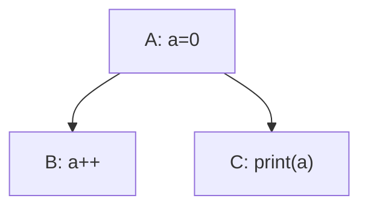

# SoftTree

「SoftTree」这个名字来自「Software」和「Dependency Tree」.

## 为什么存在?

在复杂的项目中, 各个任务/模块之间直接存在「依赖」关系, 这个依赖结构叫做「依赖树 Dependency Tree」. 出于「Don't repeat yourself.」的原则, 抽象出了名为「SoftTree」的依赖树管理.

## 什么是依赖?

依赖问题分为以下几类

### 控制依赖 Control Dependency

- $deps_c\subseteq tasks\times tasks$.
- $(tasks, deps_c)$ 是有向无环图DAG.
- 对于 $(a,b)\in deps_c$ 称作 $a$ 被 $b$ 依赖.

#### 深度 depth (忽略)

$$
depth: tasks\to\mathbb{N}\times\mathbb{N}
$$

对于$b\in task$ 有 $depths_p=\{depth(a)|(a,b)\in deps_c\}$ 满足

$$
depth(b)=\begin{cases}
    (0, 0), depths_p=\varnothing \\
    (\min depths_p+1, \max depths_p+1), else
\end{cases}
$$

#### 排序 sort

$$
sort: tasks\to\mathbb{N} \\
\forall(a,b)\in deps_c:sort(a)<sort(b)
$$

可以通过以下较为朴素的方法得到sort

```text
get_sort(tasks):
    sort = {}

    indegree[len(tasks)] = {}
    for task in tasks:
        indegree[task] = len(task.parents)

    remain = copy(tasks)
    while remain != {}:
        list = {}
        for task in remain:
            if indegree[task] = 0:
                list.insert(task)

        if list == {}:
            error()

        for task in list:
            for child in task.children:
                indegree[child] -= 1
            remain.remove(task)
            sort.insert(task)

    return sort
```

这里的写法有优化空间, 但是这里不深入探讨, 为了在数学上容易看懂.

### 数据依赖 Data Dependency

- $deps_d\subseteq tasks\times data$.
- $(t, d)\in deps_d$ 称作 $t$ 依赖数据 $d$ .

### 依赖权限 Access Dependency

- $access$ 由使用环境决定, 是能使用的权限集合.
- $access$ 至少满足 $\{\bot, \top\}\subseteq access$
- $\bot$ 意味着最低权限, $\top$ 意味着最高权限.
- $deps_a: deps_d\to access$.

## 依赖有什么问题?

### 多subtask的冲突



在这个情景下, 输出是不可预测的, 因为ABC和ACB都是满足控制依赖的条件的.

这个问题在于同一个task的多个subtask, 如果都是read操作还好, 但是如果出现write操作就会导致必须需要一个顺序去决定subtask的执行顺序.

也就是说, 对于一个数据d, 所涉及到的所有task, 如果其中包含write的操作, 那么就有可能需要一个显式的排序(不排除因为控制依赖的限制足够排序).

显式的排序这样做的话太繁琐了, 所以这里希望被提出其他解决方法.

### 扩展性差

如果希望在这个系统里添加新的task, 就有可能引发新冲突, 而且这一点要依赖于以前的显式排序, 如果显式排序本身就有隐患, 就会变得很难查明.

### 是否允许动态?

在task的调用中, 是否可能创建新的d并添加到data里, 或者task添加到tasks里? 或者删除?

绝对不可以, 这个问题的情景下的拓扑排序什么的, 十分依赖固定的tasks和data, 而且理论上通过结构体或者数组什么的, 可以实现将新数据归纳到已有数据中, 应该不会出现完全超出代码预期的数据才对.

### 权限泄漏

虽然对task来说d是readonly的, 但是如果d的属性有一个setter函数, task也是有可能意外调用的, 而且不可以预计影响.

当然Rust是可以避免的, 所以这个实际上是环境提供的access的能力限制, 有些语言无法实现, 所以难免发生这种事情.

## SoftTree做什么?

### 拆分task

限制一个task最多只能对一个d有write及以上的影响.

$$
\sum_{(task,d)\in deps_d}\mathbb{1}[deps_a(task, d)\ge writable]\le 1
$$

对于原本task如果不满足这个要求, 可以按照顺序拆分成满足条件的串联的task.

### 面向对象

#### 从属依赖

于是存在一个从属依赖$deps_b:tasks\to data$满足

$$
deps_a(task,d)\ge writable\Rightarrow deps_b(task) = d
$$

这种情况称作task属于d.

$$
tasks_d := \{task|task\in tasks,deps_b(task)=d\} \\
node_d := (d, tasks_d)
$$

#### 封装依赖

$$
deps_e \subseteq nodes\times nodes \\
$$

$$
\begin{rcases}
    \exists(task_a, task_b)\in deps_c \\
    a = deps_b(task_a) \\
    b = deps_b(task_b) \\
    node_a \neq node_b
\end{rcases}
\Leftrightarrow
(node_a, node_b) \in deps_e
$$

### DAG约束

SoftTree最大的约束是, $(nodes, deps_e)$ 也应该为DAG.

这个约束并不能从前面的情景推导得到, 而是为了解决问题而针对用户提出的限制.

而且某种意义上两个nodes之间有task反复依赖也挺怪的.

### SoftTree外

目前的SoftTree的一个缺点是, 子节点无法write父节点, 这样会导致父节点的task结束后父节点就彻底固定.

这里给出的解决方法是, 在SoftTree外解决, 在一次SoftTree后允许用户读取子节点的状态, 然后通过SoftTree暴露的接口, 去显式修改父节点.

严格来说只要在节点内写好逻辑, 实际上只需要在SoftTree外的调用一下即可, 实际上代码量应该会很少.

### SoftTree的优点

- 多task的冲突只会发生在单个模块之间, 可以直接手动串联解决
- 增强扩展性, 问题变成了模块之间的单向依赖的拼接
- 循环依赖问题只需要在SoftTree外排查即可知晓
