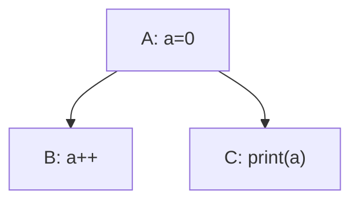
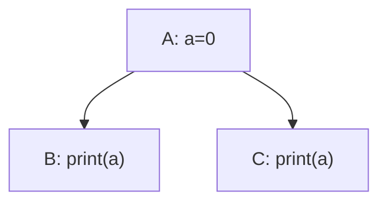
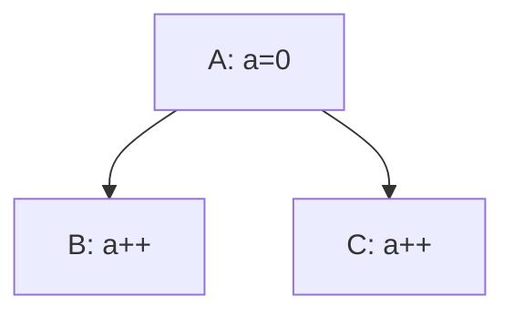

# Design - Background

The name "SoftTree" is derived from "Software" and "Dependency Tree".

## Why does it exist?

Projects can have complex dependencies between tasks or modules.
Such a structure is commonly referred to as a dependency tree.
Following the principle "Don't repeat yourself", we can extract the common dependency management logic into a higher-level abstraction called "SoftTree".

## What are dependencies?

First, there are several basic concepts to define:

- data, just data
- task, something to do, with no responsibility for storing data
- access, a task's permission to access data

There are several kinds of dependencies.

### Control Dependency

$$
deps_c\subseteq tasks\times tasks
$$

where $(tasks, deps_c)$ is a DAG.

For $(a,b)\in deps_c$, we say that $b$ depends on $a$.

$sort: tasks\to\{1,\dots,|tasks|\}$ is a bijection satisfying $\forall (a,b)\in deps_c:sort(a) < sort(b)$.

$sorts$ is the set of all possible topological orderings.

### Data Dependency

$$
deps_d\subseteq data\times tasks
$$

For $(d, t)\in deps_d$, we say that $t$ depends on $d$.

### Access

$$
deps_a: deps_d\to access
$$

---

$access^\circ$ is the set of available access levels  determined by the environment in which SoftTree is used. 

$(access^\circ, \le)$ satisfies the following properties:

- $(access^\circ, \le)$ is a partially ordered set.
- $\{\bot, \top\}\subseteq access^\circ$
- $\forall a\in access^\circ:\bot\le a\le\top$

For $a, b\in access^\circ$ with $a<b$, we say that $b$ is a higher access level than $a$.

---

$access=DM(access^\circ)$ is the Dedekind–MacNeille completion of $access^\circ$.

In this way, $(access, \le)$ satisfies the following properties:

- $(access, \le)$ is a complete lattice.
- $\forall A\subseteq access$ both $\bigvee_{a\in A}a$ and $\bigwedge_{a\in A}a$ exist.

---

A task can be considered a list of operations or smaller tasks $t = (t_1, \dots, t_n)$. In this case we can determine the minimum access level required by $t$

$$
deps_a(d, t)=\bigvee_{i\le |t|}deps_a(d, t_i)
$$

Sometimes, it is useful to consider multiple tasks as a single task. In this way, the access level of any task group can be determined.

## What are the problems?

### Conflict among multiple tasks

In this case the output may be unpredictable, because $(A, B, C)$ and $(A, C, B)$ both satisfy the sort condition of Control Dependency.

This problem can occur when a data item has multiple dependent tasks that have no control dependency between them.

Not every writable operation causes this problem.

If all the subtasks are readonly, it's OK.

If all the subtasks are order-insensitive and writable but not readable, it's also OK.

It happen when the subtasks are order-sensitive. In other words, it happens when $\bigvee_i deps_a((d, t_i))$ is order-sensitive.

In the first example, the join of `readonly` and `order-insensitive write and not read` is order-sensitive.

When the combined access level is order-sensitive, there must be an explicit order to decide which task executes first. But obviously, specifying the order explicitly is cumbersome, so we need another approach.

What we want is

$$
IDK
$$

### Poor extensibility

如果希望在这个系统里添加新的task, 就有可能引发新冲突, 而且这一点要依赖于以前的显式排序, 如果显式排序本身就有隐患, 就会变得很难查明.

### 权限泄漏

虽然对task来说d是readonly的, 但是如果d的属性有一个setter函数, task也是有可能意外调用的, 而且不可以预计影响.

当然Rust是可以避免的, 所以这个实际上是环境提供的access的能力限制, 有些语言无法实现, 所以难免发生这种事情.

### 其他

### 是否允许动态?

在task的调用中, 是否可能创建新的d并添加到data里, 或者task添加到tasks里? 或者删除?

绝对不可以, 这个问题的情景下的拓扑排序什么的, 十分依赖固定的tasks和data, 而且理论上通过结构体或者数组什么的, 可以实现将新数据归纳到已有数据中, 应该不会出现完全超出代码预期的数据才对.
