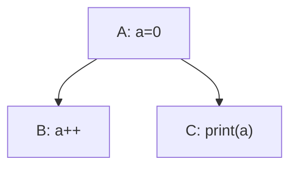
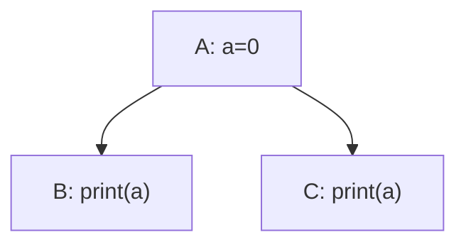
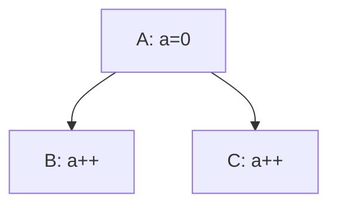

# Design

The name "SoftTree" is derived from "Software" and "Dependency Tree".

## Why does it exist?

Projects can have complex dependencies between tasks or modules.
Such a structure is commonly referred to as a dependency tree.
Following the principle "Don't repeat yourself", we can extract the common dependency management logic into a higher-level abstraction called "SoftTree".

## What are dependencies?

First, there are several basic concepts to define:

- data, just data
- task, something to do, with no responsibility for storing data
- access, a task's permission to access data

There are several kinds of dependencies.

### Control Dependency

$$
deps_c\subseteq tasks\times tasks
$$

where $(tasks, deps_c)$ is a DAG.

For $(a,b)\in deps_c$, we say that $b$ depends on $a$.

$sort: tasks\to\{1,\dots,|tasks|\}$ is a bijection satisfying $\forall (a,b)\in deps_c:sort(a) < sort(b)$.

$sorts$ is the set of all possible topological orderings.

### Data Dependency

$$
deps_d\subseteq data\times tasks
$$

For $(d, t)\in deps_d$, we say that $t$ depends on $d$.

### Access

$$
deps_a: deps_d\to access
$$

$access$ is the set of available access levels, which is determined by the environment in which SoftTree is used, partially ordered by order $\le$.

$access$ should at least satisfy $\{\bot, \top\}\subseteq access$, where $\bot$ means the lowest access level, $\top$ means the highest access level.

Thus $\forall a\in access: \bot\le a\le\top$.

## What are the problems?

### Conflict among multiple tasks

In this case the output may be unpredictable, because $(A, B, C)$ and $(A, C, B)$ both satisfy the sort condition of Control Dependency.

This problem can occur when a data item has multiple dependent tasks that have no control dependency between them.

Not every writable operation causes this problem. It would happen when the subtasks are order-sensitive.

If all the subtasks are readonly, it's OK.

If all the subtasks are order-insensitive and writable but not readable, it's also OK.

It's OK if the data is order-insensitive for all those tasks. But when there is an order-sensitive operation, there must be an explicit order to decide which task executes first.

Obviously, specifying the order explicitly is cumbersome, so we need another approach.

### 扩展性差

如果希望在这个系统里添加新的task, 就有可能引发新冲突, 而且这一点要依赖于以前的显式排序, 如果显式排序本身就有隐患, 就会变得很难查明.

### 是否允许动态?

在task的调用中, 是否可能创建新的d并添加到data里, 或者task添加到tasks里? 或者删除?

绝对不可以, 这个问题的情景下的拓扑排序什么的, 十分依赖固定的tasks和data, 而且理论上通过结构体或者数组什么的, 可以实现将新数据归纳到已有数据中, 应该不会出现完全超出代码预期的数据才对.

### 权限泄漏

虽然对task来说d是readonly的, 但是如果d的属性有一个setter函数, task也是有可能意外调用的, 而且不可以预计影响.

当然Rust是可以避免的, 所以这个实际上是环境提供的access的能力限制, 有些语言无法实现, 所以难免发生这种事情.
