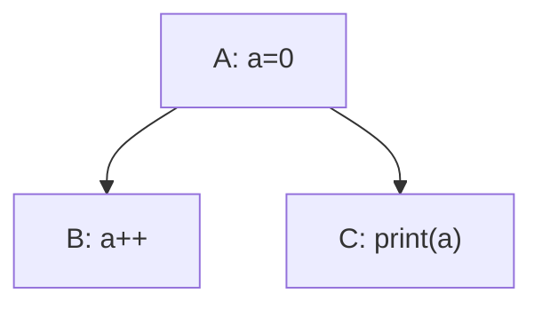
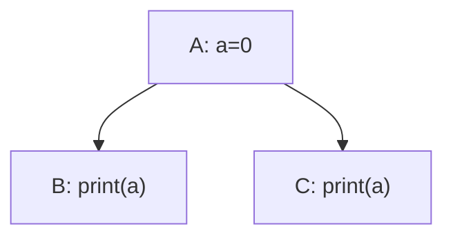
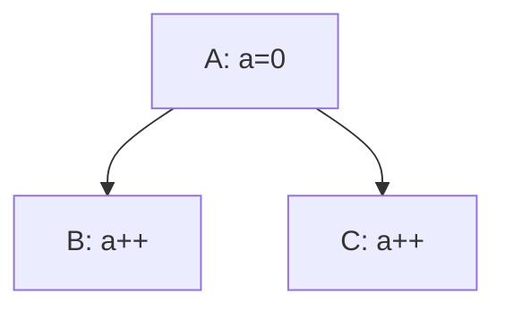

# Design - Problems

## Conflict among multiple tasks

In this case the output may be unpredictable, because $(A, B, C)$ and $(A, C, B)$ both satisfy the sort condition of Control Dependency.

This problem can occur when a data item has multiple dependent tasks that have no control dependency between them.

But multiple dependent tasks do not always cause this problem.

Assume that $access$ contains the following access levels:

- $OS$: order-sensitive
- $RO$: readonly. Example: `print`
- $OISW$: order-insensitive write without read, meaning that for a data item $d$ and two tasks $a, b$ with $deps_a(d, a), deps_a(d, b)\le OISW$, the results of $(a, b)$ and $(b, a)$ are the same. Example: `x++`

Those access levels satisfy $OS = RO\vee OISW$.

### Example 1

All the subtasks are $RO$, it's OK.

### Example 2

All the subtasks are $OISW$, it's also OK.

### Example 3

Task B is $OISW$, task C is $RO$, so 

It happens when the subtasks are order-sensitive. In other words, it happens when $\bigvee deps_a(d, t_i)$ is order-sensitive.

In the first example, the join of `readonly` and `order-insensitive write and not read` is order-sensitive.

When the combined access level is order-sensitive, there must be an explicit order to decide which task executes first. But obviously, specifying the order explicitly is cumbersome, so we need another approach.

What we want is

$$
IDK
$$

## Poor extensibility

如果希望在这个系统里添加新的task, 就有可能引发新冲突, 而且这一点要依赖于以前的显式排序, 如果显式排序本身就有隐患, 就会变得很难查明.

## 权限泄漏

虽然对task来说d是readonly的, 但是如果d的属性有一个setter函数, task也是有可能意外调用的, 而且不可以预计影响.

当然Rust是可以避免的, 所以这个实际上是环境提供的access的能力限制, 有些语言无法实现, 所以难免发生这种事情.

## 其他

### 是否允许动态?

在task的调用中, 是否可能创建新的d并添加到data里, 或者task添加到tasks里? 或者删除?

绝对不可以, 这个问题的情景下的拓扑排序什么的, 十分依赖固定的tasks和data, 而且理论上通过结构体或者数组什么的, 可以实现将新数据归纳到已有数据中, 应该不会出现完全超出代码预期的数据才对.
