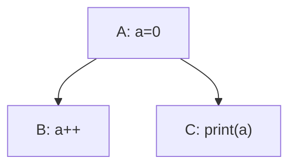
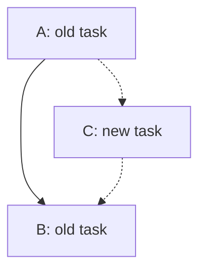

# Design - Problems

## Conflict among multiple tasks

In this case the output may be unpredictable, because $(A, B, C)$ and $(A, C, B)$ both satisfy the sort condition of Control Dependency.

This problem can occur when a data item has multiple dependent tasks that have no control dependency between them.

But multiple dependent tasks do not always cause this problem.

Assume that $access$ contains the following access levels:

- $OS$: order-sensitive
- $RO$: readonly. Example: `print`
- $OISW$: order-insensitive write without read, meaning that for a data item $d$ and two tasks $a, b$ with $deps_a(d, a), deps_a(d, b)\le OISW$, the results of $(a, b)$ and $(b, a)$ are the same. Example: `x++`

Obviously, these access levels satisfy $OS = RO\vee OISW$.

The problem happens if and only if

$$
\exists d\in data, 
\exists T\in parallel(d):
\left(
    \bigvee_{t\in T}deps_a(d, t)\ge OS
\right)
\land (|T|>1)
$$

When the combined access level is order-sensitive, there must be an explicit order to decide which task executes first. But obviously, specifying the order explicitly is cumbersome, so we need another approach.

## Poor Extensibility

If a new task is added to the system, it could cause new conflicts or invalidate the existing structure.

