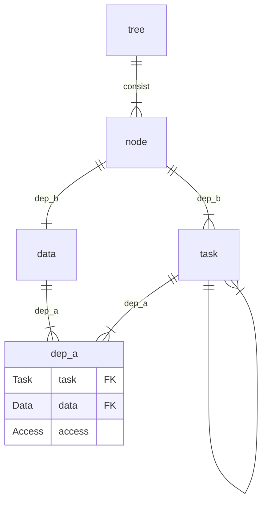

# Design - Solution

## SoftTree做什么?

### 拆分task

限制一个task最多只能对一个d有write及以上的影响.

$$
\sum_{(task,d)\in deps_d}\mathbb{1}[deps_a(task, d)\ge writable]\le 1
$$

对于原本task如果不满足这个要求, 可以按照顺序拆分成满足条件的串联的task.

### 面向对象

#### 从属依赖

于是存在一个从属依赖$deps_b:tasks\to data$满足

$$
deps_a(task,d)\ge writable\Rightarrow deps_b(task) = d
$$

这种情况称作task属于d.

$$
tasks_d := \{task|task\in tasks,deps_b(task)=d\} \\
node_d := (d, tasks_d)
$$

#### 封装依赖

$$
deps_e \subseteq nodes\times nodes \\
$$

$$
\begin{rcases}
    \exists(task_a, task_b)\in deps_c \\
    a = deps_b(task_a) \\
    b = deps_b(task_b) \\
    node_a \neq node_b
\end{rcases}
\Leftrightarrow
(node_a, node_b) \in deps_e
$$

### DAG约束

SoftTree最大的约束是, $(nodes, deps_e)$ 也应该为DAG.

这个约束并不能从前面的情景推导得到, 而是为了解决问题而针对用户提出的限制.

而且某种意义上两个nodes之间有task反复依赖也挺怪的.

### 反向node

目前的SoftTree的一个缺点是, 子节点无法write影响父节点.

这里给出的方法是, 设定有且仅有一个脱离前文管理的节点, 就是反向节点

- 反向节点可以read所有其他的节点, 并且其他节点无法知道反向节点存在
- 反向节点可以write所有其他的节点

原本以为DAG约束, 而无法实现的task, 可以在反向节点里实现.

## SoftTree的优点

- 多task的冲突只会发生在单个模块之间, 可以直接手动串联解决
- 增强扩展性, 问题变成了模块之间的单向依赖的拼接
- 循环依赖问题只需要在SoftTree外排查即可知晓

## ER图 (待完善)

## 各个语言能实现的access (待完善)

Lua: none, readonly, writable
