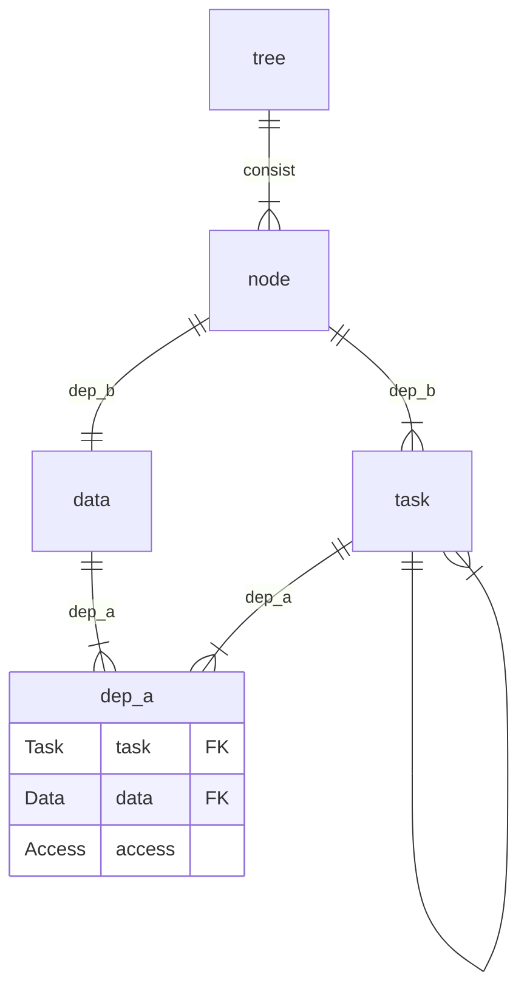

# Design - Solution

## What does SoftTree do?

### Split the Task

Each task can have an access level greater than or equal to writable for at most one data item.

$$
\forall t\in tasks:\sum_{d\in parents_d(t)}\mathbb{1}[access(d, t)\ge writable]\le 1
$$

If an existing task does not satisfy this property, it can be split into smaller tasks that do.

### Encapsulation

$$
(nodes, deps_n)
$$

Each $n=(d, T)\in nodes$ satisfies the following properties:

- $d\in data, T\subseteq tasks$
- $\forall t\in tasks:((d, t)\in deps_d \land access(d, t)\ge writable)\to t\in T$

For convenience, we use subscripts to indicate the relationships among $n$, $d$, $T$, and $t$. Variables sharing the same subscript satisfy the relations $n_i=(d_i, T_i)$ and $t_i\in T_i$.

$nodes$ satisfies the following properties:

- $\{d|(d, T)\in nodes\}=data$
- $\bigcup_{(d, T)\in nodes}T=tasks$
- $\forall n_1, n_2 \in nodes, n_1\neq n_2: T_1\cap T_2=\varnothing, d_1\neq d_2$

$deps_n \subseteq nodes\times nodes$ satisfies the following properties:

- $\forall n_1,n_2\in nodes:(n_1,n_2)\in deps_n\leftrightarrow n_1\neq n_2\land \exists (t_1, t_2)\in deps_c$

### DAG-Constraint

The strongest constraint of SoftTree is that $(nodes, deps_n)$ must also be a DAG.

Note that this constraint cannot be derived from the previous definitions.

### Backward Node

$$
n_b
$$

This node is introduced to address the problem that nodes cannot affect parent nodes in $(nodes, deps_n)$.

We call it a "node" because it has properties similar to those of normal nodes.

$n_b$ satisfies the following properties:

- $n_b\notin nodes$
- $d_b\notin data$
- $T_b\cap tasks = \varnothing$
- The tasks in $n_b$ can read and write any data item.

Some tasks cannot belong to any node in $nodes$ because of the DAG constraint, but they can belong to $n_b$.

The tasks in $n_b$ are executed after all other tasks.

## SoftTree的优点

- 多task的冲突只会发生在单个模块之间, 可以直接手动串联解决
- 增强扩展性, 问题变成了模块之间的单向依赖的拼接
- 循环依赖问题只需要在SoftTree外排查即可知晓

## ER图 (待完善)

## 各个语言能实现的access (待完善)

Lua: none, readonly, writable
