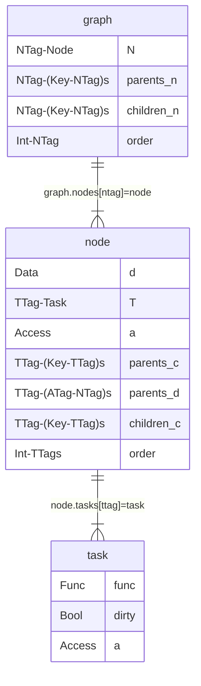

```mermaid
erDiagram
    graph {
        NTag-Node N
        NTag-(Key-NTag)s parents_n
        NTag-(Key-NTag)s children_n
        Int-NTag order
    }
    node {
        Data d
        TTag-Task T
        Access a
        TTag-(Key-TTag)s parents_c
        TTag-(ATag-NTag)s parents_d
        TTag-(Key-TTag)s children_c
        Int-TTags order
    }
    task {
        Func func
        Bool dirty
        Access a
    }

    graph ||--|{ node : "graph.nodes[ntag]=node"
    node ||--|{ task : "node.tasks[ttag]=task"
```
