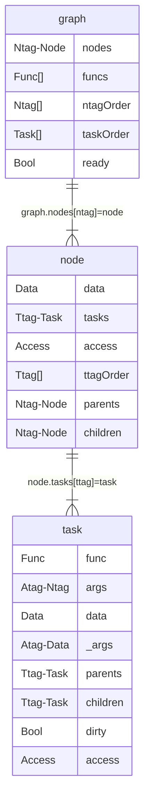

```mermaid
erDiagram
    graph {
        Ntag-Node nodes
        Func[] funcs
        Ntag[] ntagOrder
        Task[] taskOrder
        Bool ready
    }
    node {
        Data data
        Ttag-Task tasks
        Access access
        Ttag[] ttagOrder
        Ntag-Node parents
        Ntag-Node children
    }
    task {
        Func func
        Atag-Ntag args
        Data data
        Atag-Data _args
        Ttag-Task parents
        Ttag-Task children
        Bool dirty
        Access access
    }

    graph ||--|{ node : "graph.nodes[ntag]=node"
    node ||--|{ task : "node.tasks[ttag]=task"
```